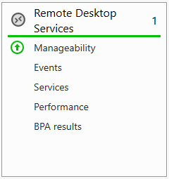
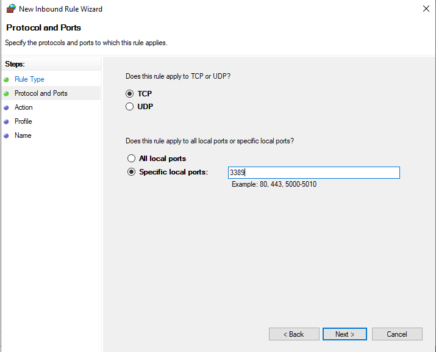
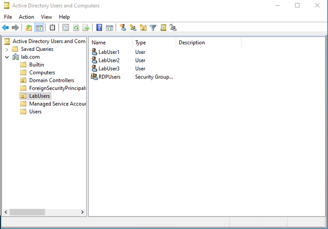
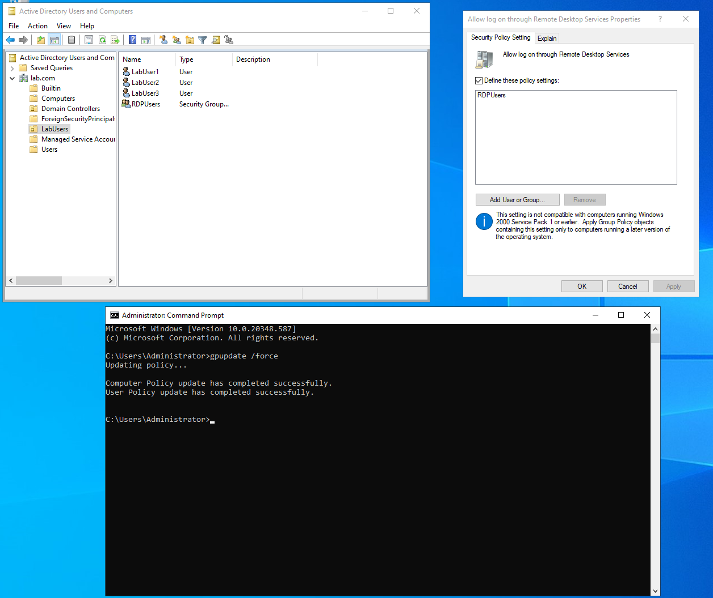
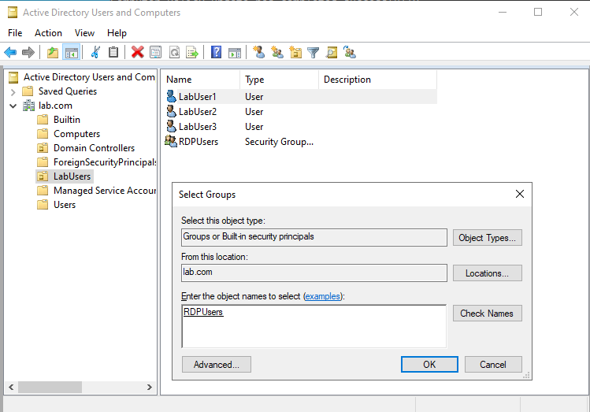
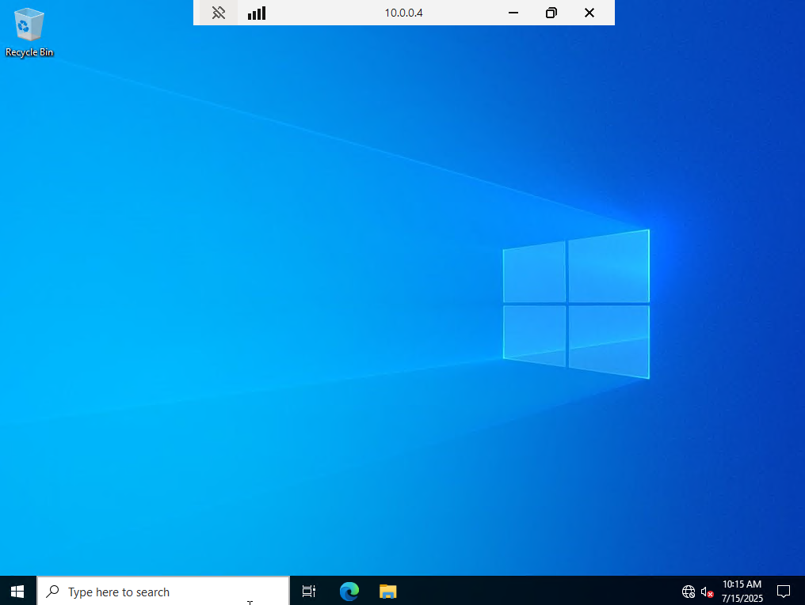
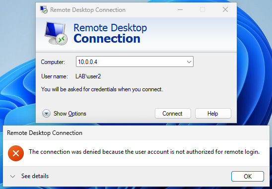

# Windows Server 2022 RDSH/Terminal Server Lab
A virtualized lab showcasing the deployment of Windows Server 2022 as a Remote Desktop Session Host (RDSH) server, including Active Directory user management, Group Policy configuration, and firewall setup to enable centralized user access via Remote Desktop Protocol (RDP) for an enterprise-like environment.Components:Windows Server 2022 (RDSH Server, Active Directory, Group Policy)

- Windows Client (RDP Clients)
- VirtualBox (Virtualization Platform)
- Remote Desktop Services, Active Directory, Group Policy, Firewall Configuration, User Profile Management

Deployed Windows Server 2022 within VirtualBox as the RDSH server

    - Installed Remote Desktop Services via the Server Manager

    - Created a new inbound firewall rule to allow RDP connections on port 3389

    - Created a new RDPUsers group on the domain controller in Active Directory

    - Allowed log on through RDP in Group Policy management and forced it to update

    - Added LabUser1 to the RDPUsers group in Active Directory

    - Tested connection from client-1 PC on the network with LabUser1 credentials for successful login.

    - LabUser2 without RDP permissions gets denied access

